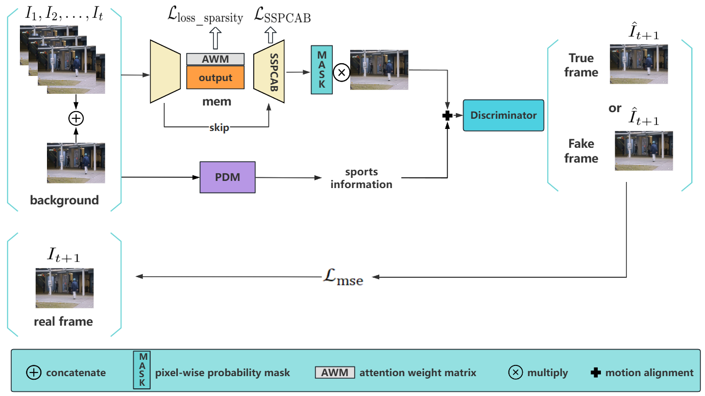

# Multi-Module Collaborative Adversarial Learning for Robust Video Anomaly Detection

Official PyTorch implementation of **Multi-Module Collaborative Adversarial Learning for Robust Video Anomaly Detection**.

This repository provides the experimental code for video anomaly detection on **UCSD Ped2**, **CUHK Avenue**, and **ShanghaiTech**. The method follows a future-frame prediction paradigm: given consecutive historical frames, the model predicts the next frame and detects abnormal events according to the prediction discrepancy between the generated frame and the real future frame.

## Overview

The proposed framework, named **MMC-AL**, integrates multiple complementary modules for robust anomaly detection:

- **GAN-based adversarial learning** for improving the realism and temporal consistency of predicted frames.
- **Memory module** for storing compact normal prototypes and suppressing abnormal reconstruction.
- **SSPCAB** for self-supervised global structural modeling through masked convolution and channel attention.
- **PDM** for motion-aware deformation alignment and multi-scale temporal motion modeling.

The whole framework is designed to jointly model spatial structures and temporal dynamics in surveillance videos.



## Project Structure

```text
DMAD-PDM/
├── Train_ped2_avenue.py                # Training script for UCSD Ped2 and Avenue
├── Evaluate_ped2.py                    # Evaluation script for UCSD Ped2
├── process_avenue.py                   # Obtain the raw anomaly scores of the Avenue dataset
├── Evaluate_avenue.py                  # Evaluation script for CUHK Avenue  
├── Train_shanghai.py                   # Training script for ShanghaiTech
├── Evaluate_shanghai.py                # Evaluation script for ShanghaiTech
├── HCFNet.py                           # Hierarchical context fusion / attention module
├── WavePooling.py                      # WaveBlock / wave pooling module
├── losses.py                           # Intensity, gradient, adversarial, and related losses
├── utils.py                            # Utility functions for anomaly score, AUC, 
│
├── model/                              # Model definition directory
│   ├── final_future_prediction_ped2.py       # Future-frame prediction model for Ped2
│   ├── final_future_prediction_avenue.py     # Future-frame prediction model for Avenue
│   ├── final_future_prediction_shanghai.py   # Future-frame prediction model for ShanghaiTech
│   ├── unet.py                               # U-Net encoder-decoder architecture
│   ├── mem.py                                # Memory module
│   ├── pix2pix_networks.py                   # Pix2Pix generator/discriminator networks
│   └── sspcab_torch.py                       # SSPCAB self-supervised prediction module
│
├── exp/                                # Experimental results and checkpoints
│   ├── res_list.npz                    # General result file
│   ├── res_list_ped2.npz               # Result file for UCSD Ped2
│   ├── res_list_avenue.npz             # Result file for CUHK Avenue
│   └── res_list_shanghai.npz           # Result file for ShanghaiTech
│
├── data/                               # Frame-level labels used during evaluation
│   ├── frame_labels_ped2.npy           # Frame-level labels for UCSD Ped2
│   ├── frame_labels_avenue.npy         # Frame-level labels for CUHK Avenue
│   └── frame_labels_shanghai.npy       # Frame-level labels for ShanghaiTech
│
└── bkg/                                # Background templates / background information
```

## Environment

The code was tested with the following environment:

```text
Python 3.8.19
PyTorch 2.4.1 + CUDA 12.4
TorchVision 0.19.1 + CUDA 12.4
OpenCV-Python 4.10.0.84
NumPy 1.21.5
```

A CUDA-enabled GPU is recommended. Some scripts use `.cuda()` directly, so CPU-only execution may require manually changing device-related code.

### Installation

```bash
conda create -n dmad-pdm python=3.8.19 -y
conda activate dmad-pdm

# Install PyTorch according to your CUDA version.
# Example for CUDA 12.4:
pip install torch==2.4.1 torchvision==0.19.1 --index-url https://download.pytorch.org/whl/cu124

# Install other dependencies
pip install numpy==1.21.5 opencv-python==4.10.0.84 scikit-learn matplotlib tqdm timm imageio
```

If your CUDA version is different, please install the corresponding PyTorch build from the official PyTorch installation guide.

## Dataset Preparation

This repository supports three commonly used video anomaly detection datasets:

- **UCSD Ped2**
- **CUHK Avenue**
- **ShanghaiTech**

If you need to download a dataset, these resources may be helpful:
* USCD Ped2 [[Dataset](http://www.svcl.ucsd.edu/projects/anomaly/UCSD_Anomaly_Dataset.tar.gz)]
* CUHK Avenue [[Dataset](http://www.cse.cuhk.edu.hk/leojia/projects/detectabnormal/Avenue_Dataset.zip)]
* ShanghaiTech [[Dataset](https://github.com/StevenLiuWen/ano_pred_cvpr2018)]
* Other files: 
Link: https://pan.baidu.com/s/14gZ8UfKyo4uiRua_8RIoBg?pwd=rb6r
Please download the datasets from their official sources and organize the extracted frames as follows:

```text
data/
├── datasets/
│   ├── ped2/
│   │   ├── training/frames/
│   │   │   ├── 01/*.jpg
│   │   │   └── ...
│   │   └── testing/frames/
│   │       ├── 01/*.jpg
│   │       └── ...
│   │
│   ├── avenue/
│   │   ├── training/frames/
│   │   └── testing/frames/
│   │
│   └── shanghai/
│       ├── training/frames/
│       └── testing/frames/
│
├── frame_labels_ped2.npy
├── frame_labels_avenue.npy
└── frame_labels_shanghai.npy
```


## Training

### UCSD Ped2 

```bash
python Train_ped2_avenue.py 
```


### CUHK Avenue

```bash
python Train_ped2_avenue.py                       
```


### ShanghaiTech

```bash
python Train_shanghai.py 
```


## Evaluation

### UCSD Ped2

```bash
python Evaluate_ped2.py 
```

### CUHK Avenue

```bash
python process_avenue.py   
python Evaluate_avenue.py 
```

### ShanghaiTech

```bash
python Evaluate_shanghai.py
```

## Method Pipeline

The core workflow of this repository is:

1. Convert videos into frame sequences.
2. Use several consecutive frames as input and predict the next future frame.
3. Enhance future-frame prediction with memory-augmented representation, SSPCAB structural learning, PDM motion alignment, and adversarial training.
4. Compute anomaly scores according to the discrepancy between predicted frames and real future frames.
5. Evaluate the detection performance using frame-level ROC-AUC.


## Acknowledgement

This implementation is developed for research on unsupervised video anomaly detection. The project is built upon future-frame prediction, adversarial learning, memory-augmented modeling, self-supervised structural prediction, and motion-aware deformation alignment.
